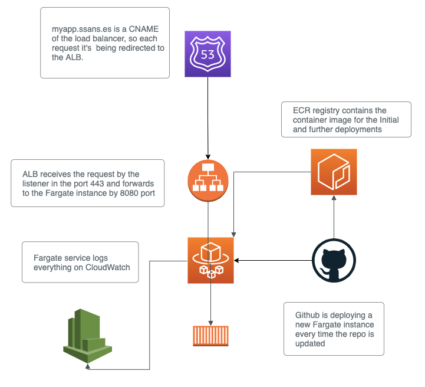
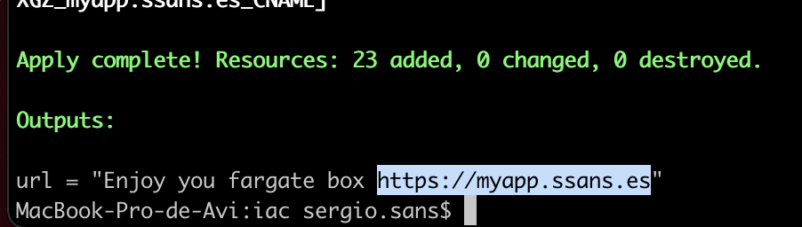
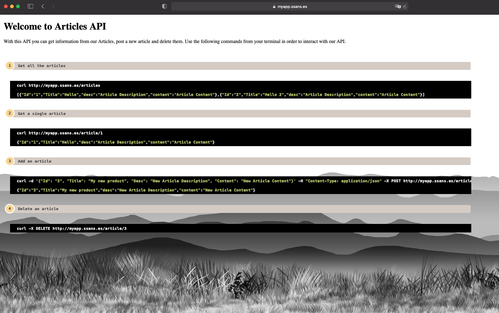
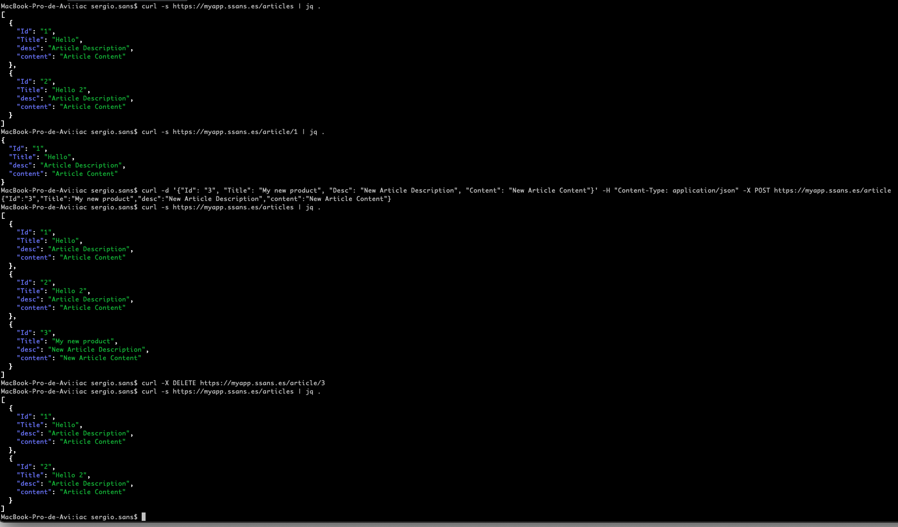
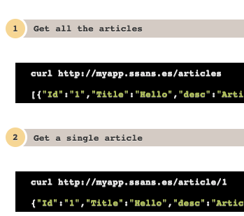

# <b>Go Application in AWS ECS Fargate</b>

## <b>Repo description</b>

This repository provides an API application in Golang. The application runs over a Golang containers in AWS Fargate.

The Infrastructure deployed consists on:

- ECS: Containers provided in a Fargate Cluster from a Fargate task executed by the corresponding Fargate service. The docker image is being pulled from ECR registry. See ```variables``` section below
- ALB: Application load balancer pointing to Fargate containers listening by 8080 port when a request is received in the HTTPS listener.
- ACM: A validated Certificate for HTTPS listener in the ALB.
- Route53:
    - DNS record as an alias of ALB dns name. This way, the Application URL can be customised.
    - DNS record for certifcate validation

Security groups, target groups, IAM policies, VPC and so on, are already provided by this repo.


<br/>

## Files and Folder structure

- <b>app:</b> Directory for the application files.

- <b>iac:</b> Directory for terraform code which provides the infrastructure in AWS.

- <b>Dockerfile:</b> Dockerfile for creating GO image

- <b>[.github/workflows/aws.yml](https://github.com/seavba/go/blob/main/.github/workflows/aws.yml):</b> Github action for building, testing and pushing docker image (CI) and also Fargate deployment (CD) it's being done from it.
<br/>

## CI / CD

This repo contains a github action triggered by every pushing or merging done in the master branch. The github actions steps are:

- Build the docker image
- Run a docker container from a docker compose and perform the testing running test.sh script
- Push the docker image
- Update task definition
- Deploy the new containers using the rolling deployment strategy.

## Getting Started

#### Pre-requisites

- AWS CLI must be already configured. If not, try [Configuration and credential file settings](https://docs.aws.amazon.com/cli/latest/userguide/cli-configure-files.html)

- The Terraform code has been wrote with Terraform v0.15.3.

- Define AWS credentials in the secrets tab of your Github repository, in order to deploy from the repo each time a push is performed


#### Deploy

For the initial deployment, the following command must be run from a terminal :

```
cd /your/repo/path
git clone git@github.com:seavba/go.git
cd go/iac && terraform init && terraform apply -auto-approve
```

Future deployments can be done pushing code to the main branch in the repo. Github action will take care of the deployment.

#### Variables
All the variables to be customised (if needed) can be found in [variables.tf](https://github.com/seavba/go/blob/main/iac/variables.tf) file.

> :warning: Important to change domain_name and zone_name variables, otherwise the deployment will fail.


###### Output Variables
After deployment, as output variables are shown:
```
Outputs:
url = "Enjoy you fargate box https://myapp.ssans.es"
```
> :warning: The URL shown in the output message is the Application link. It can be test it in any browser.


#### Destroy Infrastructure

```
cd /your/repo/path/go/iac && terraform destroy -auto-approve
```


## Demo

Deployment:

<br/>

Application look:

<br/>

Curl testing:

 - List all articles
 - Read a single article
 - Add an article
 - Delete an article

 <br/>


Pushing a change:

<br/>

Change deployment:

<br/>


CI/CD
[Github job execution]()


## Webgraphy

The following websites helped me to understand better how to implement the solution:

- [Building, deploying, and operating containerized applications with AWS Fargate](https://aws.amazon.com/es/blogs/compute/building-deploying-and-operating-containerized-applications-with-aws-fargate/)

- [Creating a RESTful API With Golang](https://tutorialedge.net/golang/creating-restful-api-with-golang/)

- [Terraform](https://www.terraform.io/)
